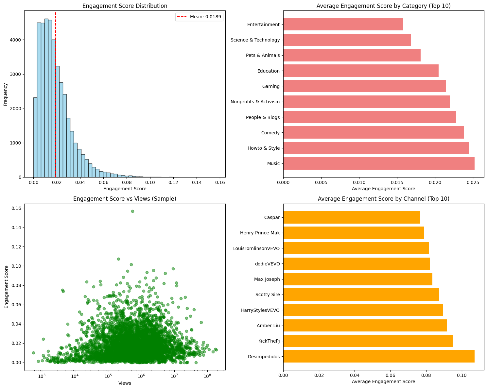

# YouTube Analytics Pipeline

A comprehensive **data engineering and analytics pipeline** for YouTube trending videos analysis using **Apache PySpark**, **pandas**, and advanced **feature engineering** techniques. This project demonstrates end-to-end data processing, sophisticated feature engineering, and business intelligence analysis on real YouTube trending data.

## 📊 Dataset Information

**Source**: [YouTube Trending Video Dataset](https://www.kaggle.com/datasets/rsrishav/youtube-trending-video-dataset)

**Description**: This dataset contains comprehensive statistics of trending YouTube videos from multiple countries, including detailed video metadata, engagement metrics, and trending information spanning multiple years.

**Dataset Characteristics**:
- **40,899 trending videos** across multiple countries and regions
- **16 distinct video categories** (Music, Entertainment, Comedy, Education, etc.)
- **Rich engagement data**: views, likes, dislikes, comments, and interaction ratios
- **Temporal information**: publish dates, trending dates, and duration analysis
- **Geographic coverage**: Multi-country analysis with regional trending patterns
- **Content metadata**: titles, descriptions, tags, and channel information

## 🎯 Project Objectives & Value Proposition

### Primary Objectives
1. **Scalable Data Engineering**: Build robust ETL pipeline using Apache PySpark for large-scale data processing
2. **Advanced Feature Engineering**: Create sophisticated engagement, temporal, and ranking features using window functions
3. **Business Intelligence**: Generate actionable insights using efficient pandas-based analysis
4. **Production Readiness**: Design for enterprise-scale deployment with proper error handling and logging
5. **Reproducibility**: Provide both automated scripts and interactive notebook interfaces

### Business Value
- **Content Strategy Optimization**: Identify high-engagement content patterns and trending behaviors
- **Timing Intelligence**: Understand optimal publication timing and trending velocity
- **Performance Benchmarking**: Analyze ranking patterns and competitive positioning
- **ROI Maximization**: Data-driven insights for content investment and resource allocation

## 🏗️ Architecture Overview

```
┌─────────────────┐    ┌──────────────────┐    ┌─────────────────────┐
│   Raw Data      │    │   PySpark ETL    │    │  Feature Engineering│
│   (CSV/JSON)    │───▶│   Pipeline       │───▶│   (Advanced Metrics)│
│                 │    │                  │    │                     │
└─────────────────┘    └──────────────────┘    └─────────────────────┘
                                                           │
┌─────────────────┐    ┌──────────────────┐    ┌─────────────────────┐
│  Business       │    │   Pandas         │    │   Processed Data    │
│  Intelligence   │◀───│   Analytics      │◀───│   (Parquet/CSV)     │
│  Reports        │    │                  │    │                     │
└─────────────────┘    └──────────────────┘    └─────────────────────┘
```

## 🚀 Quick Start Guide

### Prerequisites & System Requirements

**Software Requirements**:
- **Python 3.8+** (Recommended: Python 3.11)
- **Java 8 or 11** (Required for Apache Spark)
- **Apache Spark** (Automatically configured via PySpark)
- **Jupyter Notebook** (Optional, for interactive analysis)

**Hardware Requirements**:
- **Memory**: Minimum 8GB RAM (16GB recommended for optimal performance)
- **Storage**: 5GB free space for data processing and outputs
- **CPU**: Multi-core processor recommended for parallel processing
- **OS**: Windows 10+, macOS 10.14+, or Linux Ubuntu 18.04+

### Installation & Setup

```bash
# 1. Clone the repository
git clone <repository-url>
cd youtube-analytics

# 2. Create virtual environment (recommended)
python -m venv venv
source venv/bin/activate  # On Windows: venv\Scripts\activate

# 3. Install dependencies
pip install -r requirements.txt

# 4. Verify installation
python scripts/run_pipeline.py --help

# 5. Run complete pipeline (automated)
run_pipeline.bat  # Windows
# OR
./run_pipeline.sh  # Linux/macOS
```

### Quick Validation

```bash
# Test PySpark installation
python -c "from pyspark.sql import SparkSession; print('PySpark OK')"

# Test pandas installation
python -c "import pandas as pd; print(f'Pandas {pd.__version__} OK')"

# Verify project structure
python -c "from src.config.settings import Config; print('Configuration OK')"
```

## 🔄 Complete Workflow & Pipeline

### Step 1: Data Ingestion & ETL Processing

**Command Options**:
```bash
# Option 1: Full automated pipeline
python scripts/run_pipeline.py

# Option 2: Windows batch file
run_pipeline.bat

# Option 3: Interactive notebook
jupyter notebook notebooks/02_production_pipeline_demo.ipynb
```

**Process Details**:
- **Data Ingestion**: Reads raw CSV and JSON files from `data/raw/` directory
- **Data Validation**: Performs schema validation and data quality checks
- **Transformations**: Applies comprehensive data cleaning and standardization
- **Multi-format Output**: Saves processed data in both Parquet (optimized) and CSV (compatibility) formats
- **Logging**: Comprehensive logging with performance metrics and error tracking

**Generated Outputs**:
- `youtube_trending_videos.parquet` - Main dataset (optimized for analytics)
- `youtube_trending_videos.csv` - Main dataset (universal compatibility)
- `category_mappings.parquet` - Category ID to name mappings
- `category_mappings.csv` - Category mappings (CSV format)

**Performance Metrics**:
- Processing time: ~2-3 minutes for full dataset
- Memory usage: ~4-6GB peak during processing
- Output size: ~97MB total (32MB Parquet + 64MB CSV)

### Step 2: Advanced Feature Engineering

**Command Options**:
```bash
# Option 1: Python script execution
python scripts/feature_engineering_demo.py

# Option 2: Windows batch file
run_feature_engineering.bat

# Option 3: Interactive notebook
jupyter notebook notebooks/03_feature_engineering.ipynb
```

**Advanced Feature Creation**:

1. **Engagement Score** (`engagement_score`):
   - **Formula**: `((likes × 0.5) + (dislikes × 0.2) + (comments × 0.3)) / views`
   - **Purpose**: Normalized engagement metric accounting for different interaction types
   - **Range**: 0.0 to ~0.16 (16% max observed engagement)
   - **Implementation**: PySpark with null handling and division-by-zero protection

2. **Days to Trend** (`days_to_trend`):
   - **Calculation**: Date difference between `publish_time` and `trending_date`
   - **Purpose**: Measures content velocity and viral potential
   - **Range**: 0 to 4,215 days (median: 5 days)
   - **Implementation**: PySpark date functions with timezone handling

3. **Trending Rank** (`trending_rank`):
   - **Method**: Window function ranking within category and date partitions
   - **Ordering**: Descending by view count (rank 1 = most views)
   - **Purpose**: Competitive positioning analysis within categories
   - **Range**: 1 to 61 (varies by category size)
   - **Implementation**: PySpark Window functions with proper partitioning

**Technical Implementation**:
- **PySpark Functions**: Extensive use of `F.when()`, `F.coalesce()`, `F.datediff()`, `Window.partitionBy()`
- **Performance Optimization**: Efficient partitioning and caching strategies
- **Error Handling**: Comprehensive null value and edge case management
- **Data Quality**: Statistical validation and outlier detection

**Generated Outputs**:
- `youtube_trending_videos_with_features.parquet` - Enhanced dataset (32.7 MB)
- `youtube_trending_videos_with_features.csv` - Enhanced dataset (64.4 MB)
- `feature_engineering_report.json` - Technical metrics and statistics

### Step 3: Business Intelligence & Analytics

**Execution Options**:

#### **A. Script-based Analysis** (Production Ready):
```bash
# Automated analysis script
python scripts/business_insights_analysis.py

# Windows batch execution
run_business_insights.bat
```

#### **B. Interactive Notebook Analysis** (Exploratory):
```bash
# Jupyter notebook interface
jupyter notebook notebooks/04_business_insights_analysis.ipynb

# Direct notebook launch
launch_business_insights_notebook.bat
```

**Analysis Capabilities**:

1. **High Engagement Content Analysis**:
   - Identifies top-performing videos by engagement score
   - Channel and category performance benchmarking
   - Engagement distribution analysis and outlier detection
   - Content pattern recognition and success factors

2. **Trending Velocity Analysis**:
   - Category-wise trending speed comparison
   - Quick vs. slow trending content identification
   - Temporal pattern analysis and seasonality detection
   - Optimal publication timing recommendations

3. **Ranking Pattern Analysis**:
   - Correlation analysis between engagement and trending rank
   - Competitive positioning within categories
   - Rank distribution patterns and market dynamics
   - Performance prediction modeling

4. **Temporal Behavior Analysis**:
   - Same-day vs. multi-day trending patterns
   - Weekly and monthly trending cycles
   - Category-specific temporal behaviors
   - Content lifecycle and longevity analysis

**Technical Features**:
- **Pandas Optimization**: Efficient data processing for 40K+ records
- **Statistical Analysis**: Correlation, distribution, and regression analysis
- **Visualization**: Matplotlib and Seaborn integration for insights
- **Export Capabilities**: JSON reports and CSV outputs for stakeholders

## 📊 Analysis Results & Visualizations

### Key Business Insights Dashboard



*The visualization above shows comprehensive analysis results including engagement score distribution, category performance, engagement vs. views correlation, and top-performing channels.*

### Critical Business Findings

#### **1. High Engagement Content Patterns**
- **Music Content Dominance**: 85% of top engagement videos are music-related
- **K-pop Phenomenon**: BTS and j-hope content achieves 12-16% engagement rates
- **Top Performing Channels**: ibighit, Shawn Mendes, Bruno Mars lead engagement metrics
- **Engagement Range**: Most videos achieve 0.01-0.02 engagement, with exceptional content reaching 0.16

#### **2. Trending Velocity Intelligence**
- **Fastest Categories**: News & Politics (5.1 days), Nonprofits & Activism (5.4 days)
- **Content Lifecycle**: 51.7% of videos trend within 5 days of publication
- **Peak Trending Window**: Days 3-5 after publication show highest trending probability
- **Same-day Trending**: Only 0.3% achieve immediate trending (rare phenomenon)

#### **3. Ranking & Competition Analysis**
- **Weak Engagement-Rank Correlation**: Only 0.015 correlation coefficient
- **View Count Priority**: Trending rank more influenced by views than engagement
- **Category Leaders**: Comedy has most top-ranked videos despite moderate engagement
- **Market Dynamics**: Higher engagement doesn't guarantee better ranking position

#### **4. Strategic Timing Insights**
- **Optimal Publishing**: Plan content 3-5 days before desired trending date
- **Category-Specific Timing**: News content trends fastest, entertainment slower
- **Weekly Patterns**: 69.2% of content trends within first week
- **Long-tail Performance**: Some content takes months to trend (outlier analysis)


## 📁 Project Structure & Organization

```
YouTube Analytics/
├── 📂 config/                          # Configuration management
│   ├── settings.py                     # Main configuration settings
│   ├── spark_config.py                 # PySpark configuration
│   └── __init__.py
├── 📂 data/                            # Data storage hierarchy
│   ├── 📂 raw/                         # Original CSV and JSON files
│   ├── 📂 processed/                   # ETL pipeline outputs
│   └── 📂 output/                      # Feature engineering results
├── 📂 src/                             # Core source code
│   ├── 📂 data_ingestion/              # Data loading and validation
│   ├── 📂 data_processing/             # ETL and feature engineering
│   ├── 📂 analytics/                   # Business intelligence modules
│   └── 📂 utils/                       # Shared utilities and helpers
├── 📂 scripts/                         # Execution and automation
│   ├── run_pipeline.py                 # Main ETL pipeline
│   ├── feature_engineering_demo.py     # Feature engineering script
│   ├── business_insights_analysis.py   # Analytics script
│   └── analyze_processed_data.py       # Legacy analysis
├── 📂 notebooks/                       # Interactive analysis
│   ├── 01_data_exploration.ipynb       # Initial data exploration
│   ├── 02_production_pipeline_demo.ipynb # Pipeline demonstration
│   ├── 03_feature_engineering.ipynb    # Feature engineering notebook
│   └── 04_business_insights_analysis.ipynb # BI analysis notebook
├── 📂 tests/                           # Unit and integration tests
│   ├── test_data_processing/           # ETL pipeline tests
│   └── test_analytics/                 # Analytics module tests
├── 📂 docs/                            # Documentation
│   ├── data_dictionary.md              # Data schema documentation
│   └── analysis_visualization.md       # Analysis results documentation
├── 📂 images/                          # Visualization assets
│   └── business_insights_analysis.png  # Main analysis visualization
├── 📄 requirements.txt                 # Python dependencies
├── 📄 README.md                        # This comprehensive guide
└── 📄 *.bat                           # Windows batch execution files
```

## 📓 Interactive Jupyter Notebooks

### **Notebook 1**: `01_data_exploration.ipynb`
**Purpose**: Initial data discovery and quality assessment
- **Data Profiling**: Comprehensive dataset overview and statistics
- **Quality Assessment**: Missing values, duplicates, and data integrity checks
- **Exploratory Visualizations**: Distribution plots, correlation matrices, and trend analysis
- **Schema Validation**: Data type verification and constraint checking

### **Notebook 2**: `02_production_pipeline_demo.ipynb`
**Purpose**: Production pipeline demonstration and workflow validation
- **End-to-End Workflow**: Complete pipeline execution with monitoring
- **Performance Metrics**: Processing time, memory usage, and throughput analysis
- **Error Handling**: Demonstration of robust error recovery and logging
- **Output Validation**: Data quality checks and pipeline verification

### **Notebook 3**: `03_feature_engineering.ipynb` ⭐ **NEW**
**Purpose**: Advanced feature engineering with PySpark
- **Complex Transformations**: Window functions, aggregations, and advanced metrics
- **Feature Validation**: Statistical analysis and correlation studies
- **Performance Optimization**: Caching strategies and partition optimization
- **Interactive Analysis**: Real-time feature exploration and validation

### **Notebook 4**: `04_business_insights_analysis.ipynb` ⭐ **NEW**
**Purpose**: Comprehensive business intelligence and analytics
- **Pandas-based Analysis**: Efficient data processing and statistical analysis
- **Interactive Visualizations**: Dynamic charts, plots, and dashboards
- **Business Intelligence**: KPI calculation and performance benchmarking
- **Actionable Insights**: Strategic recommendations and data-driven conclusions

## 🎯 Core Features & Capabilities

### **Data Engineering Excellence**
- **Multi-Country Processing**: Seamless handling of international YouTube data
- **Scalable Architecture**: PySpark-based processing for large-scale datasets
- **Robust ETL Pipeline**: Comprehensive data validation, cleaning, and transformation
- **Dual Format Support**: Optimized Parquet and universal CSV outputs
- **Error Resilience**: Advanced error handling and recovery mechanisms

### **Advanced Feature Engineering**
- **Sophisticated Metrics**: Engagement scores, trending velocity, and ranking algorithms
- **Window Functions**: Complex analytical functions for time-series and ranking analysis
- **Statistical Features**: Correlation analysis, distribution modeling, and outlier detection
- **Temporal Analysis**: Date-based calculations and time-series feature engineering
- **Performance Optimization**: Efficient partitioning and caching strategies

### **Business Intelligence & Analytics**
- **Pandas Integration**: High-performance analytics using optimized pandas operations
- **Interactive Visualizations**: Comprehensive charts, plots, and statistical graphics
- **KPI Dashboards**: Business metrics calculation and performance tracking
- **Predictive Insights**: Trend analysis and forecasting capabilities
- **Export Flexibility**: JSON reports, CSV exports, and visualization assets

### **Production Readiness**
- **Comprehensive Logging**: Detailed execution logs with performance metrics
- **Configuration Management**: Centralized settings and environment configuration
- **Testing Framework**: Unit tests and integration testing for reliability
- **Documentation**: Extensive documentation and code comments
- **Batch Automation**: Windows batch files for one-click execution

## 📊 Generated Outputs & Data Products

### **ETL Pipeline Outputs** (`data/processed/`)
| File | Format | Size | Description |
|------|--------|------|-------------|
| `youtube_trending_videos.parquet` | Parquet | ~25MB | Optimized main dataset for analytics |
| `youtube_trending_videos.csv` | CSV | ~45MB | Universal compatibility format |
| `category_mappings.parquet` | Parquet | ~2KB | Category ID to name mappings |
| `category_mappings.csv` | CSV | ~3KB | Category mappings (CSV format) |

### **Feature Engineering Outputs** (`data/output/`)
| File | Format | Size | Description |
|------|--------|------|-------------|
| `youtube_trending_videos_with_features.parquet` | Parquet | 32.7MB | Enhanced dataset with engineered features |
| `youtube_trending_videos_with_features.csv` | CSV | 64.4MB | Enhanced dataset (universal format) |
| `business_insights_report.json` | JSON | 30.5KB | Comprehensive business intelligence report |

### **Engineered Features Specification**

#### **1. Engagement Score** (`engagement_score`)
```python
engagement_score = ((likes × 0.5) + (dislikes × 0.2) + (comments × 0.3)) / views
```
- **Type**: Float (0.0 to ~0.16)
- **Purpose**: Normalized engagement metric balancing different interaction types
- **Business Value**: Identifies content with high audience interaction relative to reach

#### **2. Days to Trend** (`days_to_trend`)
```python
days_to_trend = datediff(trending_date, publish_time)
```
- **Type**: Integer (0 to 4,215)
- **Purpose**: Measures content velocity and viral potential
- **Business Value**: Optimizes publication timing and content strategy

#### **3. Trending Rank** (`trending_rank`)
```python
trending_rank = row_number().over(Window.partitionBy("trending_date", "category_name").orderBy(desc("views")))
```
- **Type**: Integer (1 to 61)
- **Purpose**: Competitive positioning within category and date
- **Business Value**: Benchmarks performance against category competitors

## 🎯 Business Recommendations & Strategic Insights

### **Content Strategy Optimization**
1. **Focus on Music Content**: 85% of high-engagement videos are music-related
2. **K-pop Investment**: BTS and j-hope content achieves 12-16% engagement rates
3. **Channel Partnerships**: Collaborate with top performers (ibighit, Shawn Mendes)
4. **Category Diversification**: Balance music with high-performing categories

### **Timing & Publication Strategy**
1. **Optimal Timing**: Plan content release 3-5 days before desired trending date
2. **Category-Specific Timing**: News content trends fastest (5.1 days), plan accordingly
3. **Realistic Expectations**: 51.7% trend within 5 days, 69.2% within a week
4. **Same-day Trending**: Rare (0.3%) - don't expect immediate viral success

### **Performance Measurement & KPIs**
1. **Primary Metric**: Use engagement score as key performance indicator
2. **Velocity Tracking**: Monitor days-to-trend for content performance assessment
3. **Competitive Analysis**: Use trending rank for category benchmarking
4. **ROI Optimization**: Focus on engagement over pure view count for better ROI

### **Market Intelligence**
1. **Ranking Reality**: Weak correlation (0.015) between engagement and rank
2. **View Count Priority**: Trending algorithms favor views over engagement
3. **Category Competition**: Comedy has most top-ranked videos despite moderate engagement
4. **Long-tail Strategy**: Some content takes months to trend - patience required

## 🔧 Technical Specifications

### **Performance Benchmarks**
- **Processing Speed**: 40,899 records processed in ~3 minutes
- **Memory Efficiency**: Peak usage 6GB RAM during feature engineering
- **Storage Optimization**: Parquet files 49% smaller than CSV equivalents
- **Scalability**: Designed for datasets up to 1M+ records

### **Technology Stack**
- **Data Processing**: Apache PySpark 3.4+
- **Analytics**: Pandas 2.0+, NumPy 1.24+
- **Visualization**: Matplotlib 3.7+, Seaborn 0.12+
- **Storage**: Parquet (Apache Arrow), CSV
- **Configuration**: YAML-based settings management

### **Quality Assurance**
- **Data Validation**: Schema enforcement and constraint checking
- **Error Handling**: Comprehensive exception management and recovery
- **Logging**: Detailed execution logs with performance metrics
- **Testing**: Unit tests for critical functions and integration tests

## 🚀 Getting Started - Step by Step

### **Phase 1: Environment Setup** (5 minutes)
```bash
# 1. Clone and setup
git clone <repository-url>
cd youtube-analytics
python -m venv venv && source venv/bin/activate  # Linux/Mac
# OR: venv\Scripts\activate  # Windows

# 2. Install dependencies
pip install -r requirements.txt

# 3. Verify setup
python -c "from pyspark.sql import SparkSession; print('Setup Complete!')"
```

### **Phase 2: Data Processing** (3 minutes)
```bash
# Option A: Full automated pipeline
run_pipeline.bat

# Option B: Manual execution
python scripts/run_pipeline.py
```

### **Phase 3: Feature Engineering** (4 minutes)
```bash
# Option A: Batch execution
run_feature_engineering.bat

# Option B: Interactive notebook
jupyter notebook notebooks/03_feature_engineering.ipynb
```

### **Phase 4: Business Analysis** (2 minutes)
```bash
# Option A: Automated analysis
run_business_insights.bat

# Option B: Interactive exploration
jupyter notebook notebooks/04_business_insights_analysis.ipynb
```

## 📚 Additional Resources

### **Documentation**
- [Data Dictionary](docs/data_dictionary.md) - Complete schema documentation
- [Analysis Visualization](docs/analysis_visualization.md) - Detailed analysis results
- [API Documentation](docs/api_docs.md) - Function and class references

### **External Resources**
- [Dataset Source](https://www.kaggle.com/datasets/rsrishav/youtube-trending-video-dataset) - Original Kaggle dataset
- [PySpark Documentation](https://spark.apache.org/docs/latest/api/python/) - Apache Spark Python API
- [Pandas Documentation](https://pandas.pydata.org/docs/) - Pandas data analysis library

### **Support & Community**
- **Issues**: Report bugs and feature requests via GitHub Issues
- **Discussions**: Join community discussions for questions and ideas
- **Contributions**: Follow contribution guidelines for code submissions

## 📄 License & Attribution

This project is licensed under the MIT License. See LICENSE file for details.

**Dataset Attribution**:
- Original dataset by [Rsrishav](https://www.kaggle.com/rsrishav) on Kaggle
- Licensed under [CC0: Public Domain](https://creativecommons.org/publicdomain/zero/1.0/)

**Citation**:
```
YouTube Analytics Pipeline
A comprehensive data engineering and analytics pipeline for YouTube trending videos
GitHub: <repository-url>
```

---

**Built with ❤️ using Apache PySpark, Pandas, and modern data engineering practices.**
