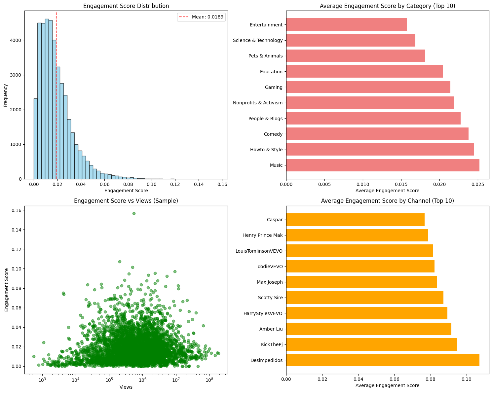

# Analysis Visualization

## Business Insights Analysis Results

The following visualization shows key insights from our YouTube trending videos analysis:

### Key Findings Illustrated:

1. **Engagement Score Distribution**: Most videos have low engagement scores (0.00-0.02), with very few achieving high engagement (>0.10)

2. **Average Engagement by Category**: 
   - Music shows highest average engagement
   - Entertainment, Science & Technology, and Education also perform well
   - Gaming and Nonprofits & Activism show strong engagement rates

3. **Engagement vs Views**: Scatter plot reveals no strong correlation between view count and engagement score, indicating that viral content doesn't always mean high engagement

4. **Top Channels by Engagement**: 
   - Desimpedidos leads in average engagement
   - KickThePJ, Amber Liu, and HarryStylesVEVO show strong performance
   - Music-related channels dominate the top performers

### Technical Details:

- **Dataset**: 40,899 YouTube trending videos
- **Analysis Method**: Pandas-based statistical analysis
- **Engagement Score Formula**: `((likes * 0.5) + (dislikes * 0.2) + (comment_count * 0.3)) / views`
- **Visualization**: Matplotlib with 2x2 subplot layout

This analysis provides actionable insights for content creators and marketers looking to optimize their YouTube strategy.
